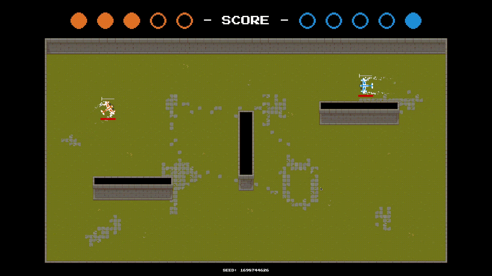

# Ace of the Heavens

Fast paced action, arcade-like, 2D top-down 1vs1 game.
You and your opponent control a plane and try to shoot each other from the sky!
Also on https://praxtube.itch.io/ace-of-the-heavens.

    

The game uses [webRTC](https://webrtc.org/) to connect two peers and communicates
on a peer 2 peer bases (if possible!). [Matchbox](https://github.com/johanhelsing/matchbox)
is used as the Rust backend to facilitate this.

## Mechanics

- Basic movement involves steering the plane and accelerating/decelerating
- Shooting bullets/rockets
- Dodging with [invincibility frames](https://en.wiktionary.org/wiki/invincibility_frame#English)
- Some basic maps
- Static camera with the same border dimensions on each map

See [here](http://rancic.org/aoth/help-menu/)
for more details.

## Future Plans

- See if I am able to create an AI and add Singleplayer if it's possible
- Add more maps
- Add Android Support maybe (probably not though)

See [here](https://github.com/PraxTube/ace-of-the-heavens/issues)
for more details.

## MacOS Builds

I haven't been able to test if the macOS builds work, if you encounter any issues here please report them.

## Development

See [here](https://github.com/PraxTube/ace-of-the-heavens/tree/master/docs/DEVELOPMENT.md).
Contributions of any kind are welcome.

## Appendix

[Credits](https://github.com/PraxTube/ace-of-the-heavens/blob/master/CREDITS.md).
[License](https://github.com/PraxTube/ace-of-the-heavens/blob/master/LICENSE),
applies to everything that doesn't already have a license.
